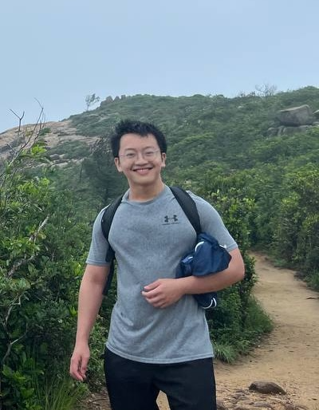
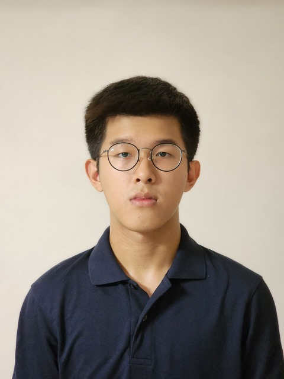

# About Us

We are a team based in the [School of Computing, National University of Singapore](https://www.comp.nus.edu.sg).

You can reach us at the email `seer[at]comp.nus.edu.sg`

## Project team

### Javier Enrique Wong

[[github](https://github.com/jav65)]
[[portfolio](team/jav65.md)]

* Role: Project Advisor
* Responsibilities: TBU

### Phanuphat Srisukhawasu (Oad)

[[github](http://github.com/oadultradeepfield)]
[[portfolio](team/oadultradeepfield.md)]

* Role: Developer
* Responsibilities: Core Application Logic and Infrastructure

### Xiaoqi

[[github](https://github.com/xiaoqi01010)]
[[portfolio](team/xiaoqi01010.md)]

* Role: Developer
* Responsibilities: TBU

### Dylan

[[github](http://github.com/Butanol)]
[[portfolio](team/butanol.md)]

* Role: Intellij Expert
* Responsibilities: Code Quality

### Chew Yue Yang

[[github](http://github.com/chewy03)]
[[portfolio](team/chewy03.md)]

* Role: Developer
