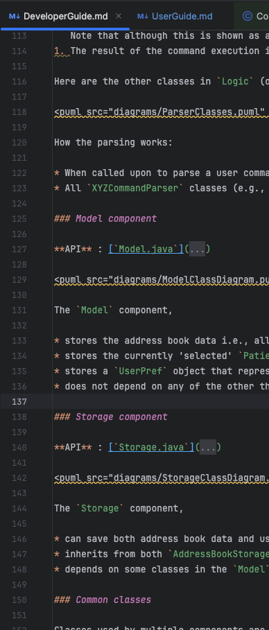

# NOKnock Developer Guide

<!-- * Table of Contents -->
<page-nav-print />

## **Acknowledgements**

This project is based on the AddressBook-Level3 project by the [SE-EDU initiative](https://se-education.org/). NOKnock uses the following libraries: [JavaFX](https://openjfx.io/), [Jackson](https://github.com/FasterXML/jackson), [JUnit5](https://github.com/junit-team/junit5).

--------------------------------------------------------------------------------------------------------------------

## **Setting up, getting started**

Refer to the guide [_Setting up and getting started_](SettingUp.md).

--------------------------------------------------------------------------------------------------------------------

## **Design**

### Architecture

<puml src="diagrams/ArchitectureDiagram.puml" width="280" />

The ***Architecture Diagram*** given above explains the high-level design of the app.

Given below is a quick overview of main components and how they interact with each other.

**Main components of the architecture**

**`Main`** (consisting of classes [`Main`](https://github.com/se-edu/addressbook-level3/tree/master/src/main/java/seedu/address/Main.java) and [`MainApp`](https://github.com/se-edu/addressbook-level3/tree/master/src/main/java/seedu/address/MainApp.java)) is in charge of the app launch and shut down.

* At app launch, it initializes the other components in the correct sequence, and connects them up with each other.
* At shut down, it shuts down the other components and invokes cleanup methods where necessary.

The bulk of the app's work is done by the following four components:

* [**`UI`**](#ui-component): The UI of the App.
* [**`Logic`**](#logic-component): The command executor.
* [**`Model`**](#model-component): Holds the data of the App in memory.
* [**`Storage`**](#storage-component): Reads data from, and writes data to, the hard disk.

[**`Commons`**](#common-classes) represents a collection of classes used by multiple other components.

**How the architecture components interact with each other**

The *Sequence Diagram* below shows how the components interact with each other for the scenario where the user issues the command `delete-patient 1`.

<puml src="diagrams/ArchitectureSequenceDiagram.puml" width="574" />

Each of the four main components (also shown in the diagram above),

* defines its *API* in an `interface` with the same name as the Component.
* implements its functionality using a concrete `{Component Name}Manager` class (which follows the corresponding API `interface` mentioned in the previous point.

For example, the `Logic` component defines its API in the `Logic.java` interface and implements its functionality using the `LogicManager.java` class which follows the `Logic` interface. Other components interact with a given component through its interface rather than the concrete class (reason: to prevent outside component's being coupled to the implementation of a component), as illustrated in the (partial) class diagram below.

<puml src="diagrams/ComponentManagers.puml" width="300" />

The sections below give more details of each component.

### UI component

The **API** of this component is specified in [`Ui.java`](https://github.com/se-edu/addressbook-level3/tree/master/src/main/java/seedu/address/ui/Ui.java)

<puml src="diagrams/UiClassDiagram.puml" alt="Structure of the UI Component"/>

The UI consists of a `MainWindow` that is made up of parts e.g.`CommandBox`, `ResultDisplay`, `PatientListPanel`, `CaringSessionsPanel`, `StatusBarFooter`, etc. All these, including the `MainWindow`, inherit from the abstract `UiPart` class which captures the commonalities between classes that represent parts of the visible GUI.

The `UI` component uses the JavaFx UI framework. The layout of these UI parts are defined in matching `.fxml` files that are in the `src/main/resources/view` folder. For example, the layout of the [`MainWindow`](https://github.com/se-edu/addressbook-level3/tree/master/src/main/java/seedu/address/ui/MainWindow.java) is specified in [`MainWindow.fxml`](https://github.com/se-edu/addressbook-level3/tree/master/src/main/resources/view/MainWindow.fxml)

The `UI` component,

* executes user commands using the `Logic` component.
* listens for changes to `Model` data so that the UI can be updated with the modified data.
* keeps a reference to the `Logic` component, because the `UI` relies on the `Logic` to execute commands.
* depends on some classes in the `Model` component, as it displays `Patient` and `CaringSession` objects residing in the `Model`.

### Logic component

**API** : [`Logic.java`](https://github.com/se-edu/addressbook-level3/tree/master/src/main/java/seedu/address/logic/Logic.java)

Here's a (partial) class diagram of the `Logic` component:

<puml src="diagrams/LogicClassDiagram.puml" width="550"/>

The sequence diagram below illustrates the interactions within the `Logic` component, taking `execute("delete 1")` API call as an example.

<puml src="diagrams/DeleteSequenceDiagram.puml" alt="Interactions Inside the Logic Component for the `delete 1` Command" />

<box type="info" seamless>

**Note:** The lifeline for `DeleteCommandParser` should end at the destroy marker (X) but due to a limitation of PlantUML, the lifeline continues till the end of diagram.

</box>

#### Sequence Diagram — Edit Command

The diagram below shows how `AddressBookParser`, `EditCommandParser`, `EditDescriptor`, and `LogicManager`
interact when parsing and executing an `edit` command.
<puml src="diagrams/EditSequenceDiagram.puml" alt="Interactions Inside the Logic Component for the `delete 1` Command" />

How the `Logic` component works:

1. When `Logic` is called upon to execute a command, it is passed to an `AddressBookParser` object which in turn creates a parser that matches the command (e.g., `DeleteCommandParser`) and uses it to parse the command.
1. This results in a `Command` object (more precisely, an object of one of its subclasses e.g., `DeletePatientCommand`) which is executed by the `LogicManager`.
1. The command can communicate with the `Model` when it is executed (e.g. to delete a person). 
   Note that although this is shown as a single step in the diagram above (for simplicity), in the code it can take several interactions (between the command object and the `Model`) to achieve.
1. The result of the command execution is encapsulated as a `CommandResult` object which is returned back from `Logic`.

Here are the other classes in `Logic` (omitted from the class diagram above) that are used for parsing a user command:

<puml src="diagrams/ParserClasses.puml" width="600"/>

How the parsing works:

* When called upon to parse a user command, the `AddressBookParser` class creates an `XYZCommandParser` (`XYZ` is a placeholder for the specific command name e.g., `AddPatientCommandParser`) which uses the other classes shown above to parse the user command and create a `XYZCommand` object (e.g., `AddPatientCommand`) which the `AddressBookParser` returns back as a `Command` object.
* All `XYZCommandParser` classes (e.g., `AddPatientCommandParser`, `DeletePatientCommandParser`, ...) inherit from the `Parser` interface so that they can be treated similarly where possible e.g, during testing.

### Model component

**API** : [`Model.java`](https://github.com/se-edu/addressbook-level3/tree/master/src/main/java/seedu/address/model/Model.java)

<puml src="diagrams/ModelClassDiagram.puml" width="450" />

The `Model` component,

* stores the data i.e., all `Patient` objects (which are contained in a `UniquePatientList` object).
* stores the currently 'selected' `Patient` objects (e.g., results of a search query) as a separate _filtered_ list which is exposed to outsiders as an unmodifiable `ObservableList<Patient>` that can be 'observed' e.g. the UI can be bound to this list so that the UI automatically updates when the data in the list change.
* stores a `UserPref` object that represents the user’s preferences. This is exposed to the outside as a `ReadOnlyUserPref` objects.
* does not depend on any of the other three components (as the `Model` represents data entities of the domain, they should make sense on their own without depending on other components)

### Storage component

**API** : [`Storage.java`](https://github.com/se-edu/addressbook-level3/tree/master/src/main/java/seedu/address/storage/Storage.java)

<puml src="diagrams/StorageClassDiagram.puml" width="550" />

The `Storage` component,

* can save both the data and user preferences in JSON format, and read them back into corresponding objects.
* inherits from both `AddressBookStorage` and `UserPrefStorage`, which means it can be treated as either one (if only the functionality of only one is needed).
* depends on some classes in the `Model` component (because the `Storage` component's job is to save/retrieve objects that belong to the `Model`)

### Common classes

Classes used by multiple components are in the `seedu.noknock.commons` package.

--------------------------------------------------------------------------------------------------------------------

## **Implementation**

This section describes some noteworthy details on how certain features are implemented.

### Viewing Caring Sessions for Today/This Week

#### Implementation

The viewing feature is implemented through `CaringSessionPanel`, which gathers all caring sessions from patients and groups them by date for display.

**Key Components**

* **`CaringSessionPanel`**: Builds and manages the flattened list of grouped sessions.
* **`GroupedCaringSessionCell`**: Renders either a date header or a session card depending on item type.
* **`CaringSessionCard`**: Displays individual session details such as patient name, care type, time, and status.
* **`DateHeader`**: Represents the date grouping shown above sessions of the same day.

Below is the partial class diagram for the **UI layer**, showing the key display components and their relationships.

<puml src="diagrams/CaringSessionViewUIClassDiagram.puml" alt="Caring Session View UI Class Diagram" />

The **Model layer** defines how patient and session data are structured and linked.

<puml src="diagrams/CaringSessionViewModelClassDiagram.puml" alt="Caring Session View Model Class Diagram" />

**Process Overview**

1. `CaringSessionPanel` receives an `ObservableList<Patient>` from the model.
2. All sessions are collected, sorted by date and time, and grouped using a `LinkedHashMap<Date, List<PatientCaringSession>>`.
3. A flattened list is built by alternating `DateHeader` and `PatientCaringSession` items.
4. `GroupedCaringSessionCell` renders each entry as either a header or a `CaringSessionCard`.
5. Any model update triggers a view refresh automatically.

The sequence below illustrates this flow at runtime.

<puml src="diagrams/CaringSessionViewSequenceDiagram.puml" alt="Caring Session View Sequence Diagram" />

---

## **Documentation, logging, testing, configuration, dev-ops**

* [Documentation guide](Documentation.md)
* [Testing guide](Testing.md)
* [Logging guide](Logging.md)
* [Configuration guide](Configuration.md)
* [DevOps guide](DevOps.md)

--------------------------------------------------------------------------------------------------------------------

## **Appendix: Requirements**

### Product scope

**Target user profile**:

* Nursing home staff who need to manage many patients and their Next-of-Kin (NOK) contacts
* Prefer command-line interfaces over GUIs for speed and efficiency
* Can type fast and are comfortable using text-based systems
* Need to track patient information, NOK details, and daily caring sessions
* Value lightweight, reliable tools that reduce manual paperwork and coordination errors

**Value proposition**: Replace manual scheduling and contact-tracking methods with a fast,
CLI-based system that improves coordination, safety, and productivity in elderly care.

### User stories

Priorities: High (must have) - `* * *`, Medium (nice to have) - `* *`, Low (unlikely to have) - `*`

| Priority | As a …​              | I want to …​                                      | So that I can…​                                            |
|----------|----------------------|---------------------------------------------------|------------------------------------------------------------|
| `* * *`  | nurse                | add a patient                                     | create a new patient record in the system                  |
| `* * *`  | nurse                | edit a patient’s information                      | keep records accurate and up to date                       |
| `* * *`  | nurse                | delete a patient                                  | remove discharged patients and their related data          |
| `* * *`  | nurse                | add a NOK to a patient                            | store emergency and family contacts for coordination       |
| `* * *`  | nurse                | edit NOK details                                  | ensure contact info (phone, relation) is accurate          |
| `* * *`  | nurse                | delete a NOK                                      | keep only relevant contacts                                |
| `* * *`  | nurse                | search for a patient by name                      | quickly locate their information                           |
| `* * *`  | nurse                | search for a patient by NOK name                  | retrieve a patient even if I only know the relative’s name |
| `* * *`  | nurse                | create a caring session                           | record scheduled care activities for patients              |
| `* * *`  | nurse                | specify the date and time of a session            | know exactly when the care task should happen              |
| `* * *`  | nurse                | update or cancel a caring session                 | correct mistakes or remove outdated tasks                  |
| `* * *`  | nurse                | mark a caring session as completed                | track what has been done vs what’s still pending           |
| `* * *`  | nurse                | view today’s caring sessions                      | focus on tasks due today                                   |
| `* * *`  | nurse                | view upcoming sessions                            | prepare ahead for the next few days                        |
| `* * *`  | nurse                | list all patients                                 | see a summary of who is currently in the system            |
| `* * *`  | nurse                | view detailed patient info (with NOKs & sessions) | get a full picture of patient care and contacts            |
| `* * *`  | nurse                | back up and restore patient/schedule data         | prevent loss of important records                          |
| `* *`    | nurse                | set recurring caring sessions                     | avoid re-entering common tasks (e.g., daily hygiene)       |
| `* *`    | nurse                | filter a schedule by patient                      | focus on a single patient’s tasks                          |
| `* *`    | nurse                | export a patient’s schedule (e.g., CSV)           | share it with families or doctors                          |
| `* *`    | nurse                | use short command aliases                         | type commands faster                                       |
| `* *`    | nurse                | undo the last command                             | fix mistakes without retyping                              |
| `* *`    | nurse                | view command history                              | repeat frequent actions quickly                            |
| `* *`    | new nurse            | follow an onboarding tutorial                     | learn to use the app efficiently                           |
| `*`      | nurse                | use autocomplete for inputs                       | avoid typing full commands/names                           |
| `*`      | nurse on night shift | enable dark mode                                  | reduce eye strain during late hours                        |
| `*`      | nurse                | categorize patients by urgency/severity           | prioritize care for critical patients                      |

### Use Cases

For all use cases below, the **System** is `NOKnock` and the **Actor** is the `nurse`, unless specified otherwise.

#### UC1: Add patient

**MSS**

1. Nurse enters `add-patient n/NAME ic/IC_NUMBER w/WARD [t/TAG]...`.
2. System validates inputs.
3. System adds the patient to the patient list.
4. System returns success message with patient name and IC.

   Use case ends.

**Extensions**

* 2a. Invalid input → System shows parameter-specific error.
  Use case ends.

* 2b. Duplicate IC → System shows `A patient with this IC already exists in the database`.
  Use case ends.

#### UC2: Edit patient

**MSS**

1. Nurse enters `edit-patient INDEX [n/NAME] [ic/IC_NUMBER] [w/WARD] [t/TAG]...`.
2. System validates index and inputs.
3. System updates patient record.
4. System returns confirmation.

   Use case ends.

**Extensions**

* 2a. Index out of range → System shows `The patient index provided is invalid`.
  Use case ends.

* 2b. Duplicate IC → System shows `A patient with this IC already exists in the database`.
  Use case ends.

#### UC3: Delete patient

**MSS**

1. Nurse enters `delete-patient INDEX`.
2. System validates index.
3. System deletes patient and cascades deletion of related NOKs and sessions.
4. System returns deletion confirmation.

   Use case ends.

**Extensions**

* 2a. Invalid index → System shows `Invalid patient index. Please use a number from the patient list`.
  Use case ends.

* 2b. Confirm prompt (if implemented) → Nurse confirms/cancels.
  Use case ends.

#### UC4: View patient details

**MSS**

1. Nurse enters `view-patient INDEX`.
2. System retrieves patient, NOK list, and upcoming sessions.
3. System displays full profile.

   Use case ends.

**Extensions**

* 2a. Invalid index → System shows `The patient index provided is invalid`.
  Use case ends.

#### UC5: List patients

**MSS**

1. Nurse enters `list-patients`.
2. System displays all patients (index, name, IC, ward, tags).

   Use case ends.

**Extensions**

* 2a. No patients → System shows `0 person(s) listed!`.
  Use case ends.

#### UC6: Add Next-of-Kin (NOK)

**MSS**

1. Nurse enters `add-nok PATIENT_INDEX n/NAME p/PHONE r/RELATIONSHIP`.
2. System validates patient index and NOK fields.
3. System associates NOK with patient and persists.
4. System returns confirmation.

   Use case ends.

**Extensions**

* 2a. Invalid patient index → System shows `The patient index provided is invalid`.
  Use case ends.

* 2b. Invalid phone number → System shows `Phone numbers should only contain numbers, and it should be at least 3 digits long`.
  Use case ends.

* 2c. Duplicate NOK → System shows `This next of kin already exists for this patient`.
  Use case ends.

#### UC7: Edit NOK

**MSS**

1. Nurse enters `edit-nok PATIENT_INDEX NOK_INDEX [n/NAME] [p/PHONE] [r/RELATIONSHIP]`.
2. System validates indices and inputs.
3. System updates NOK record.
4. System returns confirmation.

   Use case ends.

**Extensions**

* 2a. Invalid indices → System shows `The patient/Next-of-Kin index provided is invalid`.
  Use case ends.

#### UC8: Delete NOK

**MSS**

1. Nurse enters `delete-nok PATIENT_INDEX NOK_INDEX`.
2. System validates indices.
3. System removes NOK from patient.
4. System returns confirmation.

   Use case ends.

**Extensions**

* 2a. Invalid indices → System shows `The patient/Next-of-Kin index provided is invalid`.
  Use case ends.

#### UC9: Add caring session

**MSS**

1. Nurse enters `add-session PATIENT_INDEX d/DATE time/TIME type/CARE_TYPE [notes/NOTES]`.
2. System validates index, date, time, and business rules (e.g., not in past).
3. System adds session to patient schedule and persists.
4. System returns confirmation with session details.

   Use case ends.

**Extensions**

* 2a. Invalid date/time → System shows parameter-specific error.
  Use case ends.

* 2b. Invalid patient index → System shows `The patient index provided is invalid`.
  Use case ends.

#### UC10: Edit caring session

**MSS**

1. Nurse enters `edit-session PATIENT_INDEX SESSION_INDEX [d/DATE] [time/TIME] [type/CARE_TYPE] [notes/NOTES] [status/STATUS]`.
2. System validates indices and fields.
3. System updates session and persists.
4. System returns confirmation including updated status.

   Use case ends.

**Extensions**

* 2a. Invalid indices → System shows `The patient/caring session index provided is invalid`.
  Use case ends.

* 2b. Invalid date/time/status → System shows parameter-specific error.
  Use case ends.

#### UC11: Delete caring session

**MSS**

1. Nurse enters `delete-session PATIENT_INDEX SESSION_INDEX`.
2. System validates indices.
3. System deletes the session from the patient.
4. System returns confirmation.

   Use case ends.

**Extensions**

* 2a. Invalid indices → System shows `The patient/caring session index provided is invalid`.
  Use case ends.

#### UC12: View today’s sessions

**MSS**

1. Nurse enters `sessions-today`.
2. System collects sessions scheduled for today.
3. System displays list or message if none.

   Use case ends.

**Extensions**

* 2a. No sessions → System shows `Today's caring sessions: 0 patients`.
  Use case ends.

#### UC13: View this week’s sessions

**MSS**

1. Nurse enters `sessions-week`.
2. System computes current week range and collects sessions.
3. System displays list or message if none.

   Use case ends.

**Extensions**

* 2a. No sessions → System shows `This week's caring sessions: 0 patients`.
  Use case ends.

#### UC14: Complete caring session

**MSS**

1. Nurse enters `edit-session PATIENT_INDEX SESSION_INDEX status/complete` (or uses dedicated complete command).
2. System validates indices and current status.
3. System marks session as completed and persists.
4. System returns confirmation.

   Use case ends.

**Extensions**

* 2a. Invalid indices → System shows `The patient/caring session index provided is invalid`.
  Use case ends.

#### UC15: Find patients by name

**MSS**

1. Nurse enters `find-patient KEYWORD [MORE_KEYWORDS]...`.
2. System performs case-insensitive partial match search on patient names.
3. System displays matching results or none message.

   Use case ends.

**Extensions**

* 2a. No matches → System shows `0 person(s) listed!`.
  Use case ends.

#### UC16: Find patients by NOK name

**MSS**

1. Nurse enters `find-by-nok KEYWORD [MORE_KEYWORDS]...`.
2. System searches NOK lists and returns associated patients.
3. System displays results or none message.

   Use case ends.

**Extensions**

* 2a. No matches → System shows `0 person(s) listed!`.
  Use case ends.

#### UC17: Help and command discovery

**MSS**

1. Nurse enters `help` or uses Help menu/F1.
2. System displays help window or inline guidance.

   Use case ends.

**Extensions**

* 2a. Help window minimized → System attempts to restore or notifies user where to find it.
  Use case ends.

### Non-Functional Requirements

1. Should work on any mainstream OS as long as it has Java `17` or above installed.
2. Should be able to hold up to 1000 persons without a noticeable sluggishness in performance for typical usage.
3. A user with above-average typing speed for regular English text (i.e. not code, not system admin commands) should be able to accomplish most of the tasks faster using commands than using the mouse.
4. Core operations (searches, contact updates, session scheduling) should have response times **<= 200 milliseconds** under normal and peak load; under extreme conditions response times must remain **<= 1 second**.
5. Startup time should not exceed **2 seconds** on a standard laptop.
6. The app must not crash during adding / update / delete operations.
7. Data integrity must be guaranteed if the program exits unexpectedly (use atomic writes, journaling, or equivalent).
8. Data should be recoverable if corrupted (automatic backups, repair utilities, or restore procedures).
9. Stored contact data must be protected from direct user access (appropriate access control, file permissions, and storage abstractions).
10. All patient / next-of-kin and other sensitive information must be encrypted at rest and in transit, accessible only to authorised personnel, and handled in compliance with all relevant privacy laws (e.g., PDPA for Singapore, HIPAA where applicable) and organizational policies.
11. Commands should be clear and unambiguous for non-tech-savvy users; a user with no prior CLI knowledge should find the features intuitive to use.
12. All new code modules must include automated unit tests that cover at least **80%** of the new logic.
13. The system must be highly available (target **>= 99.9% uptime**) to ensure staff can access it whenever needed, including during emergencies.

### Glossary

* **Mainstream OS**: Windows, Linux, Unix, MacOS
* **Private contact detail**: A contact detail that is not meant to be shared with others
* **Intuitive**: User should be able to understand how the feature works by reading relevant parts of the user guide.
* **Patient**: A resident of the nursing home whose personal details, medical condition, and caring sessions are recorded in the system.
* **Next-of-Kin (NOK)**: A relative or contact person linked to a patient who can be reached for updates or emergencies.
* **Caring Session**: A scheduled or completed care activity (e.g., medication, feeding, hygiene) assigned to a patient.
* **Recurring Session**: A caring session that automatically repeats at regular intervals (e.g., daily, weekly).
* **Overdue Session**: A caring session that has not been completed after its scheduled time.
* **Schedule**: A list or view of all caring sessions for one or more patients, including upcoming, completed, and overdue ones.
* **Urgency Category**: A label indicating how critical a patient’s care needs are (e.g., High, Medium, Low).
* **Command**: A text instruction entered by the user to perform an action (e.g., addpatient, deletesession).
* **Command Alias**: A short version of a command for quicker input (e.g., ap for addpatient).
* **Command History**: A record of previously executed commands that can be recalled or repeated.
* **Model**: The component that manages the application’s data in memory, including patients, NOKs, and caring sessions.
* **Storage**: The component that saves and retrieves data (patients, NOKs, sessions) from disk in JSON format.
* **UI (User Interface)**: The part of the system that interacts with the user through text-based (CLI) commands and output.
* **Undo/Redo**: Features that allow users to reverse or reapply their most recent changes.
* **Backup**: A saved copy of all data that can be used to restore the system after a failure or data loss.
* **Restore**: The process of loading previously backed-up data into the system.
* **Export (CSV)**: The function that outputs patient or session data to a .csv file for sharing or external use.
* **User Preferences**: Saved settings such as window size, UI theme (e.g., dark mode), or file locations.
* **Dark Mode**: A display option with a darker color scheme to reduce eye strain, especially useful for night shifts.
* **CLI (Command-Line Interface)**: A text-based interface that lets users interact with the app by typing commands.
* **Mainstream OS**: Windows, Linux, MacOS.
* **Data Integrity**: Ensuring that all stored information remains accurate, consistent, and free from corruption.
* **JSON**: The data format (JavaScript Object Notation) used by NOKnock for saving and loading files.
* **CSV**: A data format (Comma-Separated Values) used for exporting or backing up patient and session data for external use.

--------------------------------------------------------------------------------------------------------------------

## **Appendix: Instructions for manual testing**

These instructions combine quick-start steps and feature-specific test cases to provide a practical checklist for manual testing. They are a starting point; testers should perform additional exploratory testing.

<box type="info" seamless>

**Note:** Commands shown use the CLI\/GUI command box. Replace `INDEX`, `PATIENT_INDEX`, `NOK_INDEX`, `SESSION_INDEX`, `NAME`, `IC_NUMBER`, `WARD`, `DATE`, `TIME`, `CARE_TYPE`, `PHONE`, `RELATIONSHIP`, `NOTES` with appropriate values.

</box>

### Launch and quick start

1. Initial launch
    1. Place the jar file in an empty folder.
    2. Run `java -jar noknock.jar` (or double-click the jar).
        - Expected: GUI opens with sample data and command box visible.
    3. Try `help`.
        - Expected: Help window opens / help message shows.

2. Quick start commands (verify basic command parsing and responses)
    1. `list-patients` — Expected: table or list of patients or `No patients in the system`.
    2. `add-patient n/Dylan ic/S1234567A w/2A` — Expected: `New patient added: Dylan`.
    3. `add-nok 1 n/Oad p/6598765432 r/son` — Expected: `Added NextOfKin: Oad to Patient: Yue Yang`.
    4. `sessions-today` — Expected: list of today's sessions or `Today's caring sessions: 0 patients`.
    5. `exit` — Expected: application exits cleanly.

3. Window preferences
    1. Resize/move window and close.
    2. Re-launch the app.
        - Expected: previous window size and position restored (preferences saved).

### Patient management

#### Add patient

Add patient to NOKnock

1. Command: `add-patient n/Name ic/IC_NUMBER w/WARD [t/TAG]...`
2. Expected: success message with name and IC.
3. Edge cases: add with duplicate IC → `A patient with this IC already exists in the database`. Missing params → parameter-specific error.

#### List and view

List and view all patients in the database.

1. Test case: `list-patients` \
   Expected: all patients.
2. Test case: `view-patient 1` \
   Expected: full profile including NOKs and sessions.
3. Test case: `view-patient 999` (Invalid Index where index > size)
   Expected: Index Error → `The patient index provided is invalid`.

#### Edit patient

Edit a patient's details.

1. Test Case: `edit-patient 1 n/Bob w/1A`  \
   Expected: The first patient's name and ward are updated to "Bob" and "1A" respectively.
2. Test Case: Invalid index \
   Expected: Index Error
3. Test Case: duplicate IC \
   Expected: Duplicate Error

#### Delete patient (important: cascades)

Prerequisites: Ensure multiple patients listed with `list-patients`.

1. Test case: `delete-patient 1` \
   Expected: patient deleted and related NOKs/sessions removed; status message updated.
2. Test case: `delete-patient 0` / `delete-patient` / `delete-patient x` where x > size \
   Expected: error message, no deletion.

### Next-of-Kin (NOK) management

#### Add NOK

1. Test case: `add-nok PATIENT_INDEX n/NAME p/PHONE r/RELATIONSHIP` \
   Expected: Success message.
2. Test case: Duplicate NOK with same name and phone for same patient \
   Expected: Duplicate error. Message → `This next of kin already exists for this patient`.

#### Edit NOK

1. Test case: `edit-nok PATIENT_INDEX NOK_INDEX [n/NAME] [p/PHONE] [r/RELATIONSHIP]`\
   Expected: updated NOK message or error if patient/NOK not found.

#### Delete NOK

1. `delete-nok PATIENT_INDEX NOK_INDEX` — Expected: success message, or `The patient/Next-of-Kin index provided is invalid`.

### Caring session management

#### Add session

1. Command: `add-session PATIENT_INDEX d/DATE time/TIME type/CARE_TYPE [notes/NOTES]` \
   Expected: `Caring session added for <NAME>: <TYPE> on <DATE> at <TIME>`. Invalid date/time → parameter-specific error.
2. Example: `add-session 1 d/2024-12-25 time/14:30 type/medication notes/Give insulin shot` \

#### Edit session

1. `edit-session PATIENT_INDEX SESSION_INDEX [d/DATE] [time/TIME] [type/CARE_TYPE] [notes/NOTES] [status/STATUS]`
2. Example: `edit-session 1 2 d/2024-12-25 time/14:30 status/completed`
3. Expected: `Edited CaringSession: <TYPE> on <DATE> at <TIME> of Patient: <NAME>`.

#### Delete session

1`delete-session PATIENT_INDEX SESSION_INDEX` — Expected: session removed message or `The patient/caring session index provided is invalid`.

#### Views

1. `sessions-today` — Expected: today's sessions list or `Today's caring sessions: 0 patients`.
2. `sessions-week` — Expected: this week's sessions or `This week's caring sessions: 0 patients`.

<puml src="diagrams/SessionsTodayCommandSequenceDiagram.puml" width="850" />

Sequence diagram for `sessions-today` command.

#### Complete session

1. Mark complete via `edit-session` with `status/completed` or dedicated command if present.
2. Already completed → `Session already completed`.

### Finding / searching

#### Find patients by name

1. `find-patient KEYWORD [MORE_KEYWORDS]...`
2. Expected: list of matching patients (case-insensitive, partial match) or `No patients found matching: ...`.

#### Find by NOK name

1. `find-by-nok KEYWORD [MORE_KEYWORDS]...`
2. Expected: patients matched via NOK name or `No patients found with NOK matching: ...`.

### Saving and data integrity

#### Automatic saving

Modify data (add/edit/delete). Close app and reopen.

- Expected: changes persisted in `data/addressbook.json` next to the jar.

### Corrupted/missing data file

1. Simulate: rename or corrupt `data/addressbook.json`.
2. Launch app.
    - Expected: app starts with empty data and creates a fresh data file; warn user (follow the app's documented behavior). Backup file before editing manually.

#### Backup and restore manual test (if supported)

Export/backup, then restore, verify data matches original.

### Example test session (regression checklist)

1. Launch app.
2. `add-patient n/Test ic/T1234567A w/1B`
3. `list-patients` → confirm presence.
4. `add-nok 1 n/Lee p/651234567 r/daughter`
5. `add-session 1 d/2025-12-01 time/09:00 type/hygiene notes/Assist with shower`
6. `view-patient 1` → confirm NOK and session shown.
7. `edit-session 1 1 status/completed`
8. `delete-nok 1 1`
9. `delete-patient 1`
10. Close and reopen app → confirm persistent state matches expectations.

---

## Notes

- For every test case, record command, expected output, actual output, and pass/fail.
- Tests that modify state should be followed by verification steps (e.g., `list-patients`, `view-patient`).
- Automated unit tests should complement manual tests; aim for coverage of edge cases (invalid params, out-of-range indices, duplicate entries).
