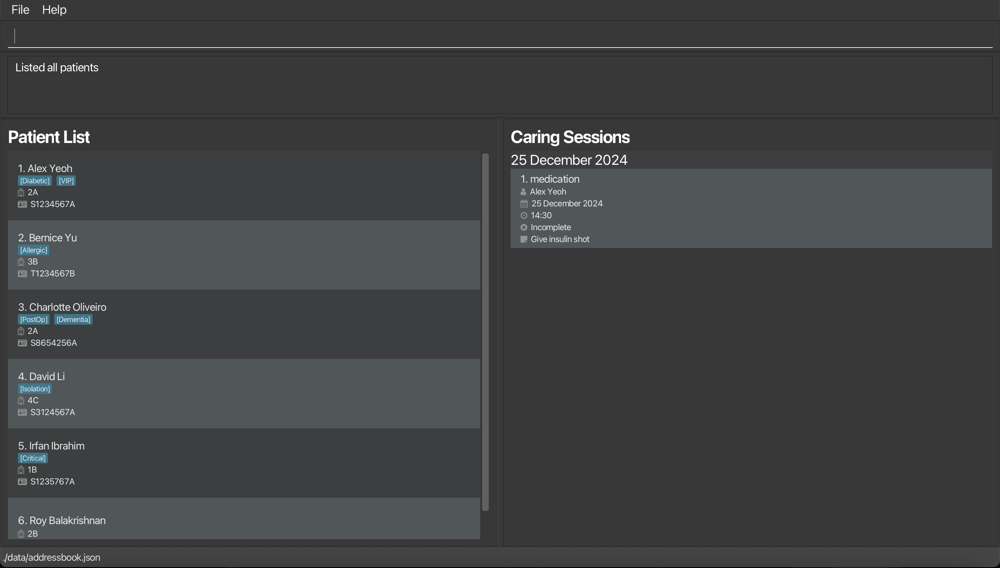
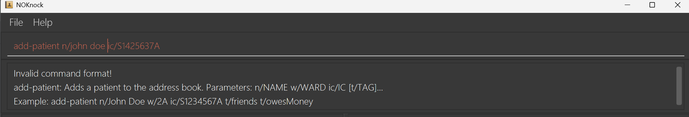
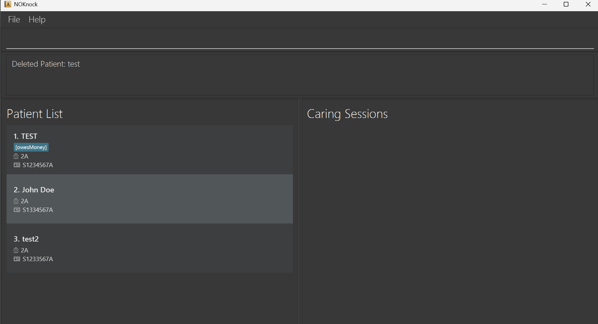
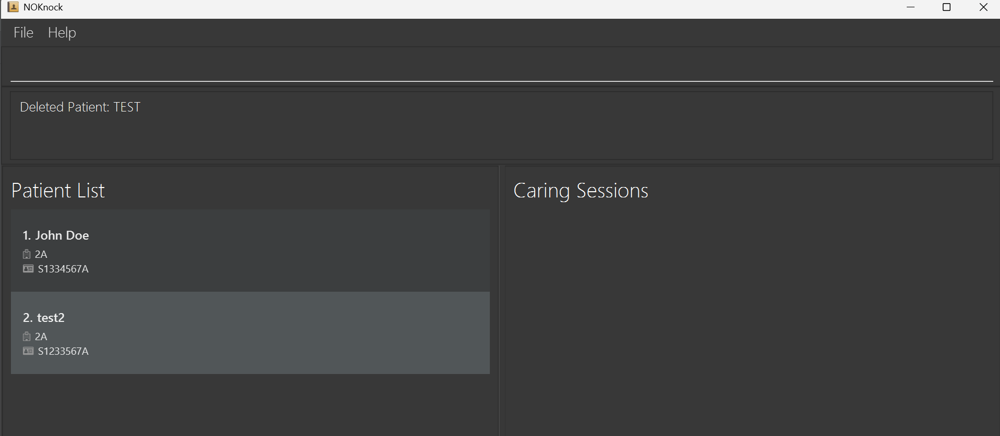
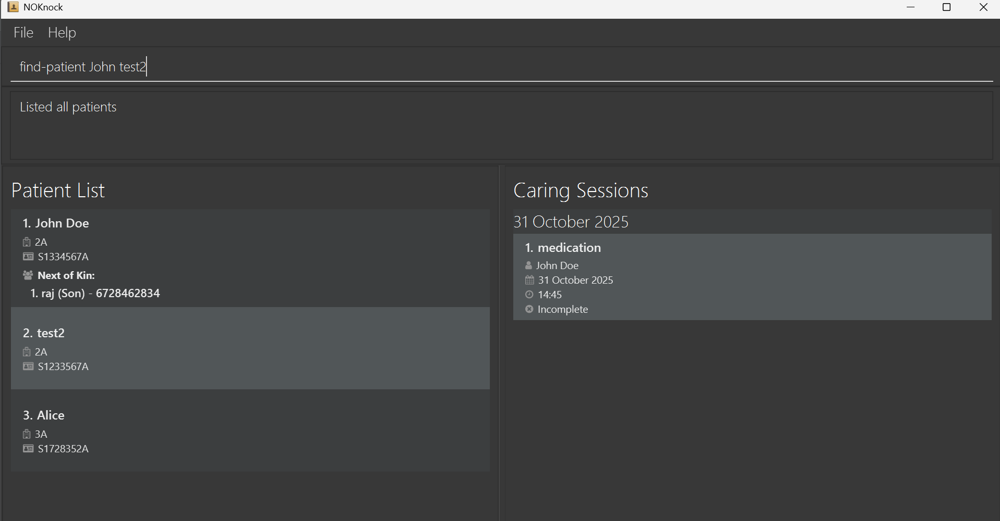
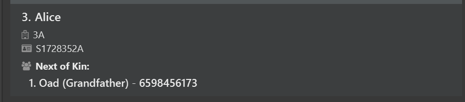
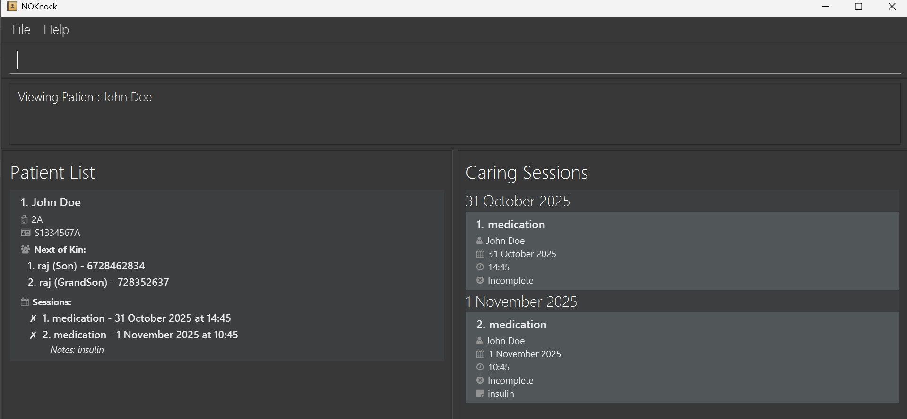

# NOKnock User Guide

<!--* Table of Contents -->
<page-nav-print />

## What is NOKnock?

Do you have trouble keeping track of the care your patients need? Do you wish that you didn't have to go through entire Excel sheets whenever you need to contact a patient's family? We've got the solution!

NOKnock! Who's there? NOKnock is a fast :runner:, keyboard-driven :musical_keyboard: app for nursing homes to track patients, their Next‑of‑Kin (NOK) contacts, and caring sessions. It is optimized for day-to-day floor operations where speed :clock1:, accuracy :round_pushpin:, and auditability matter more than complex GUIs. All it takes is the ability to type short commands! :satisfied:

### Who is This Guide For?

- You are a nursing home staff member (nurse, care aide, coordinator, or supervisor) who:
    - is comfortable typing short commands or following copy‑paste instructions.
    - may have little or no prior CLI experience. No scripting knowledge is required.
    - wants a reliable, offline tool that works consistently across different computers.
- If you prefer point‑and‑click only, you can still use NOKnock’s GUI window, but the fastest workflow uses commands.

<box type="tip" seamless>
New to the command line? You can copy each command from this guide and paste it into NOKnock’s command box. Start with the “5‑minute first task” below to get confident quickly.
</box>

---

## Why a CLI-first app (and how NOKnock is different)

- Speed and consistency: Commands are quicker than navigating menus, especially for repetitive tasks (add → edit → schedule).
- Fewer errors: A structured command format reduces ambiguity and helps prevent duplicate or inconsistent records.
- Works offline: All data stays on your machine in a simple JSON file—no internet required.
- Purpose‑built for nursing homes: Built‑in linkage between Patient ⇄ NOK ⇄ Caring Sessions fits actual eldercare workflows.
- Lightweight and portable: A single .jar file you can run on any machine with Java `17` or higher.

**Comparison:**

| Feature                 | Spreadsheets                       | GUI-Only Tools                     | NOKnock (CLI-First)                  |
|-------------------------|-----------------------------------|-----------------------------------|-------------------------------------|
| Structured Data          | Limited                          | Moderate                          | Strong (IDs, linked NOKs & sessions)|
| Bulk Operations          | Manual                           | Slower                            | Fast via commands                   |
| Offline Usage            | Yes                              | Varies                             | Yes                                 |
| Scheduling Awareness     | Manual                           | Often limited                      | Date/Time-aware                     |

---

## Quick start

1. Ensure your system meets the [system requirements](#system-requirements) and has Java `17` — see [Getting Java 17](#getting-java-17).
2. [Set up the app](#setting-up).
3. Type commands — follow the [5‑minute first task](#5-minute-tutorial) to try the core workflow.
4. Refer to the [Features](#features) below for details of each command.

---

## System requirements

- **Operating system:**
    - Windows 10 or 11 (x64)
    - macOS 12+ (Intel or Apple Silicon)
    - Linux (e.g., Ubuntu 20.04+/Debian 11+/Fedora 36+) with glibc compatible with Java `17`
- **Java:** JDK/JRE 17 or newer 
- **Disk:** ~200 MB free (app + data headroom)
- **Permissions:** Write access to the folder containing the .jar
- **Network:** Only needed for downloads and updates

---

## Getting Java `17`

Choose one of the following:

- **Windows:** https://se-education.org/guides/tutorials/javaInstallationWindows.html
- **macOS:** https://se-education.org/guides/tutorials/javaInstallationMac.html
- **Linux:** https://se-education.org/guides/tutorials/javaInstallationLinux.html

<box type="info" seamless>
If <code>java -version</code> fails, restart your terminal or computer, then try again. Reinstall Java if needed.
</box>

---

## Setting up

1. Download the latest `.jar` file from the Releases page:
   https://github.com/AY2526S1-CS2103T-W09-2/tp/releases

2. Choose (or create) a folder to act as your **NOKnock** home folder, and copy the `.jar` file into it.

3. Open a command terminal and change into that folder:
    - **Windows (PowerShell):**
      ```
      cd "C:\path\to\your\NOKnock"
      java -jar noknock.jar
      ```
    - **macOS/Linux (Terminal):**
      ```
      cd ~/NOKnock
      java -jar noknock.jar
      ```

4. A GUI should appear within a few seconds. The app starts with sample data so you can try commands immediately.

   

---

## 5-minute tutorial

Follow this quick walkthrough to learn the core workflow. Copy each command into NOKnock’s command box and press Enter.

**1) List current patients**
~~~
list-patients
~~~

**2) Add a new patient**
~~~
add-patient n/Aisha Tan ic/S1234567A w/2A t/diabetes
~~~
Expected:
~~~
Patient added: Aisha Tan (S1234567A)
~~~

**3) Find your patient’s index**
~~~
find-patient aisha
~~~
Note the Index shown for “Aisha Tan” (e.g., 5). Use that number in the next commands instead of X.

**4) Add a Next‑of‑Kin for that patient (replace X with patient index)**
~~~
add-nok X n/Daniel Tan p/98765432 r/son
~~~
Expected:
~~~
NOK added for Aisha Tan: Daniel Tan (son, 98765432)
~~~

**5) Schedule a caring session (replace X; adjust date/time as needed)**
~~~
add-session X d/2025-11-01 time/09:30 type/medication notes/Metformin 500mg
~~~
Expected:
~~~
Caring session added for Aisha Tan: medication on 2025-11-01 at 09:30
~~~

**6) View the full patient profile**
~~~
view-patient 1
~~~
You’ll see Aisha’s details, linked NOK(s), and upcoming sessions in one place.

**7) Optional:** See today’s sessions
~~~
sessions-today
~~~

<box type="tip" seamless>
If you want the session to appear here, schedule one with today’s date.
</box>

<box type="tip" seamless>
Made a typo? Use <code>edit-patient</code>, <code>edit-nok</code>, or <code>edit-session</code> to update fields; or the <code>delete-*</code> commands to remove entries. See Features below for full command formats and options.
</box>

<box type="info" seamless>

**Notes about the command format:**<br>

* Words in `UPPER_CASE` are parameters to be filled by the user.<br>
  e.g. `add-patient n/NAME ic/IC w/WARD → add-patient n/Dylan ic/S1234567A w/2A`

* Items in square brackets `[ ]` are optional.<br>
  e.g. `add-patient n/NAME ic/IC [t/TAG]` can be used with or without `t/TAG`.

* Items with `...` can appear multiple times (including zero if the item is optional).<br>
  e.g. `[t/TAG]...` → no tags, one tag, or many tags.

* Parameters can be in any order.<br>
  e.g. `n/NAME w/WARD ic/IC` = `ic/IC w/WARD n/NAME`.

* Additional parameters for commands that do not accept them will be ignored.<br>
  e.g. `help abc` = `help`.

* NOKnock automatically trims leading, trailing, and excess intermediate spaces in user input for key fields:
  e.g. <code>ic/S1234567A&nbsp;&nbsp;&nbsp;&nbsp;&nbsp;&nbsp;&nbsp;</code> → <code>ic/S1234567A</code>,  
  <code>n/Jane&nbsp;&nbsp;&nbsp;&nbsp;&nbsp;Doe</code> → <code>n/Jane Doe</code>.

* All of the commands are 1 indexed. E.g. `delete-patient 1` means deleting the first person.

* If you are using a PDF version of this document, be careful when copying and pasting commands that span multiple lines as space characters surrounding line-breaks may be omitted when copied over to the application.
* 
</box>

---

## Viewing help : `help`

Shows a message explaining how to access the help page.


**Format:**
`help`

---

## Patient Management

### Listing all patients: `list-patients`

Displays all patients with basic information.

**Format:**  
`list-patients`

**Output:**

* Success → Table with Index, Name, IC, Ward, Tags, NOK List, Caring Session List
* None → Shows an empty table with column headers but no entries.
<br/><br/>
  

### Adding a patient: `add-patient`

Creates a new patient record.

**Format:**  
`add-patient n/NAME ic/IC w/WARD [t/TAG]...`

**Examples:**

* `add-patient n/Dylan w/2A ic/S1234567A`
* `add-patient n/Javier w/8B ic/S9876543B t/diabetes t/mobility-issues`

<box type="tip" seamless>

**Tip:** You can always enter the command phrase to be prompted the right usage of commands

</box>



<box type="warning" seamless>

**Common mistakes**: It is common for one to enter the orders of fields wrongly, e.g.,

```
add-patient n/Amy ic/S1234567A w/2A
```

</box>

<box type="tip" seamless>

**Note:** Tags are optional and can be used to describe medical or care-related info.

</box>

**Output:**

* Success → `Patient added: Dylan (S1234567A)`
* Duplicate → `Patient with IC S1234567A already exists`
* Invalid input → parameter-specific error message

**Note:** A patient is considered a **duplicate** when the **IC** matches exactly.

### Editing a patient: `edit-patient`

Updates an existing patient’s information. At least one field must be provided.

**Format:**  
`edit-patient INDEX [n/NAME] [ic/IC] [w/WARD] [t/TAG]...`

**Examples:**

* `edit-patient 1 n/Yue Yang`
* `edit-patient 2 t/diabetes t/wheelchair`

**Output:**

* Success → `Patient updated: Yue Yang (S1234567A)`
* Invalid index → `Patient index X is out of range`
* Duplicate IC → `This patient already exists in the address book`

❌ **Possible mistake**: `edit-patient 1` is incorrect because no field was provided.
### Deleting a patient: `delete-patient`

Removes a patient and all associated data (NOKs, sessions).

**Format:**  
`delete-patient INDEX`

**Example:**  
`delete-patient 1`

**Output:**

* Success → `Patient deleted: Yue Yang`
* Failure → `Invalid patient index. Please use a number from the patient list.`

<box type="warning" seamless>

**Caution:** Deleting a patient also deletes all related NOK and caring session data.

</box>

<box type="tip" seamless>

Once the first person is deleted, the original second person becomes the first. To delete first N patients,
use the `delete-patient 1` command for N times





</box>

### Viewing patient details: `view-patient`

Shows full patient details including NOKs and upcoming sessions.

**Format:**  
`view-patient INDEX`

**Example:**  
`view-patient 2`

**Output:**

* Success → Full profile with NOK list and upcoming sessions.
* Failure → `The patient index provided is invalid`


### Finding patients by name: `find-patient`

Search for patients by name (case-insensitive, partial matching).

**Format:**  
`find-patient KEYWORD [MORE_KEYWORDS]...`

**Examples:**

* `find-patient dylan`
* `find-patient javier wong`

**Output:**

* Success → `2 persons listed!` + list
* None → `0 persons listed!`

<box type="tip" seamless>

**Tip**: You can enter multiple keywords(capitalised or non-capitalised is fine) to find more than 1 patient. E.g

</box>




<box type="warning" seamless>

**Common Mistake**: keywords must match at least 1 word in patient's name. A prefix will not yield
any result.

</box>

### Finding patients by NOK name: `find-by-nok`

Search for patients based on their NOK’s name.

**Format:**  
`find-by-nok KEYWORD [MORE_KEYWORDS]...`

**Examples:**

* `find-by-nok oad`
* `find-by-nok javier smith`

**Output:**

* Success → `2 persons listed!` + list
* None → `0 persons listed!`

---

## Next-of-Kin (NOK) Management

### Adding a NOK: `add-nok`

Adds a Next-of-Kin contact for a patient.

**Format:**  
`add-nok PATIENT_INDEX n/NAME p/PHONE r/RELATIONSHIP`

**Examples:**

* `add-nok 1 n/Oad p/98765432 r/son`
* `add-nok 2 n/Dr. Kapikapi p/6234-5678 r/doctor`

**Output:**

* Success → `Added NextOfKin: Oad to Patient: Dylan`
* Duplicate → `This next of kin already exists for this patient`

**Note:** A NOK is considered a **duplicate** when both the **Name** and **Phone** match exactly. *(Comparison is case-sensitive.)*

<box type="tip" seamless>

**Tip**: you can always use the `list-patients` command to see the list of patients before deciding which patient the NOK should be added to.

</box>

After adding a patient, you should see something similar to the picture below



### Editing a NOK: `edit-nok`

Updates NOK details.

**Format:**  
`edit-nok PATIENT_INDEX NOK_INDEX [n/NAME] [p/PHONE] [r/RELATIONSHIP]`

**Example:**  
`edit-nok 1 1 p/88888888`

**Output:**

* Success → `Edited NextOfKin: oad of Patient: Dylan`
* Failure → `The patient/Next-of-Kin index provided is invalid`

### Deleting a NOK: `delete-nok`

Removes a NOK from a patient.

**Format:**  
`delete-nok PATIENT_INDEX NOK_INDEX`

**Example:**  
`delete-nok 1 2`

**Output:**

* Success → `Deleted NextOfKin: oad`
* Failure → `The patient/Next-of-Kin index provided is invalid`

---

## Caring Session Management

### Adding a session: `add-session`

Schedules a care session for a patient.

**Format:**  
`add-session PATIENT_INDEX d/DATE time/TIME type/CARE_TYPE [notes/NOTES]`

**Examples:**

* `add-session 1 d/2024-12-25 time/14:30 type/medication notes/Give insulin shot`
* `add-session 2 d/25-12-2024 time/2:30pm type/hygiene`

**Output:**

* Success → `Caring session added for Dylan: medication on 2024-12-25 at 14:30`
* Failure → parameter-specific error (e.g. invalid date/time)

### Editing a session: `edit-session`

Edit an existing care session for a patient. You may also update the session status (`complete` or `incomplete`).

**Format:**
`edit-session PATIENT_INDEX SESSION_INDEX [d/DATE] [time/TIME] [type/CARE_TYPE] [notes/NOTES] [status/STATUS]`

**Examples:**

* `edit-session 1 2 d/2024-12-25 t/14:30 type/medication notes/Adjust dose status/complete`
* `edit-session 2 1 status/incomplete`

**Output:**

* Success -> `Added Caring Session: medication on 2025-12-25 at 14:30 to Patient: Javier`
* Failure -> parameter-specific error (e.g. invalid date/time or indices)

<box type="tip" seamless>

**Tip**: To get a better view of the caring session for a specific patient before editing, use `view-patient`
command. E.g. To edit a session of first patient, limit the caring sessions view to that of the first patient only

</box>



### Deleting a session: `delete-session`

Deletes a care session from a patient.

**Format:**  
`delete-session PATIENT_INDEX SESSION_INDEX`

**Example:**
`delete-session 1 2`

**Output:**

* Success → `Deleted caring session for medication on 2025-12-25 at 14:30: Javier`
* Failure → `The patient/caring session index provided is invalid`

### Viewing today’s sessions: `sessions-today`

Displays all caring sessions scheduled for today.

**Format:**  
`sessions-today`

**Output:**

* Success → `today's sessions list` + list
* None → `No caring sessions scheduled for today` + Shows an empty table with column headers but no entries.

### Viewing this week’s sessions: `sessions-week`

Displays all caring sessions scheduled for the current week (Monday to Sunday).

**Format:**  
`sessions-week`

**Output:**

* Success → `this week's sessions` + list
* None → `No caring sessions scheduled for this week` + Shows an empty table with column headers but no entries.

---

## Data Management

### Saving the data

NOKnock data are saved in the hard disk automatically after any command that changes the data. There is no need to save manually.

### Editing the data file

NOKnock data are saved automatically as a JSON file `[JAR file location]/data/noknock.json`. Advanced users are welcome to update data directly by editing that data file.

<box type="warning" seamless>

**Caution:** If your changes to the data file makes its format invalid, NOKnock will discard all data and start with an empty data file at the next run. Hence, it is recommended to take a backup of the file before editing it.

Furthermore, certain edits can cause the NOKnock to behave in unexpected ways (e.g., if a value entered is outside the acceptable range). Therefore, edit the data file only if you are confident that you can update it correctly.

</box>

---

## FAQ

**Q**: How do I transfer my data to another Computer?<br>
**A**: Install the app in the other computer and overwrite the empty data file it creates with the file that contains the data of your previous NOKnock home folder.

**Q**: Which files do I copy when migrating to another computer?<br>
**A**: Copy the entire `data` folder (especially `data/noknock.json`) from your old NOKnock home folder to the same location beside the `.jar` on the new machine. Optionally copy `preferences.json` to keep window size/position and UI settings.

**Q**: Where is my data stored?<br>
**A**: By default, in `[JAR folder]/data/noknock.json`. Preferences are saved in `[JAR folder]/preferences.json`.

**Q**: How do I back up and restore my data?<br>
**A**: Close the app, then copy `data/noknock.json` to a safe location. To restore, replace the existing `data/noknock.json` with your backup (while the app is closed).

**Q**: Can I change where data is saved?<br>
**A**: Not currently. Data is stored next to the `.jar` in `data/noknock.json`. To move the data, move the `.jar` and the `data` folder together to a new location.

**Q**: How do I update to a new version without losing data?<br>
**A**: Download the new `.jar` and place it in the same folder as your existing `data` folder. Keep the folder structure intact. You can rename the new file to `noknock.jar` or use the versioned file name when running `java -jar`.

---

## Known issues

1. **When using multiple screens**, if you move the application to a secondary screen, and later switch to using only the primary screen, the GUI will open off-screen. The remedy is to delete the `preferences.json` file created by the application before running the application again.
2. **If you minimize the Help Window** and then run the `help` command (or use the `Help` menu, or the keyboard shortcut `F1`) again, the original Help Window will remain minimized, and no new Help Window will appear. The remedy is to manually restore the minimized Help Window.

---

## Command Summary

| **Action**                                                       | **Format / Example**                                                                                                                                                                      |
|------------------------------------------------------------------|-------------------------------------------------------------------------------------------------------------------------------------------------------------------------------------------|
| [**List Patients**](#listing-all-patients-list-patients)         | `list-patients`                                                                                                                                                                           |
| [**View Patient**](#viewing-patient-details-view-patient)        | `view-patient INDEX`                                                                                                                                                                      |
| [**Add Patient**](#adding-a-patient-add-patient)                 | `add-patient n/NAME ic/IC_NUMBER w/WARD [t/TAG]...`<br>e.g. `add-patient n/Dylan ic/S1234567A w/2A t/diabetes`                                                                            |
| [**Edit Patient**](#editing-a-patient-edit-patient)              | `edit-patient INDEX [n/NAME] [w/WARD] [ic/IC_NUMBER] [t/TAG]...`<br>e.g. `edit-patient 1 n/Yue Yang`                                                                                      |
| [**Delete Patient**](#deleting-a-patient-delete-patient)         | `delete-patient INDEX`<br>e.g. `delete-patient 2`                                                                                                                                         |
| [**Add NOK**](#adding-a-nok-add-nok)                             | `add-nok PATIENT_INDEX n/NAME p/PHONE r/RELATIONSHIP`<br>e.g. `add-nok 1 n/Oad p/+6598765432 r/son`                                                                                       |
| [**Edit NOK**](#editing-a-nok-edit-nok)                          | `edit-nok PATIENT_INDEX NOK_INDEX [n/NAME] [p/PHONE] [r/RELATIONSHIP]`<br>e.g. `edit-nok 1 1 p/+6588888888`                                                                               |
| [**Delete NOK**](#deleting-a-nok-delete-nok)                     | `delete-nok PATIENT_INDEX NOK_INDEX`                                                                                                                                                      |
| [**Add Caring Session**](#adding-a-session-add-session)          | `add-caring-session PATIENT_INDEX d/DATE t/TIME type/CARE_TYPE [notes/NOTES]`<br>e.g. `add-caring-session 1 d/2024-12-25 t/14:30 type/medication notes/Give insulin shot`                 |
| [**Edit Caring Session**](#editing-a-session-edit-session)       | `edit-caring-session PATIENT_INDEX SESSION_INDEX [d/DATE] [t/TIME] [type/CARE_TYPE] [notes/NOTES] [status/STATUS]`<br>e.g. `edit-caring-session 1 2 d/2024-12-25 t/14:30 status/complete` |
| [**Delete Caring Session**](#deleting-a-session-delete-session)  | `delete-caring-session PATIENT_INDEX SESSION_INDEX`<br>e.g. `delete-caring-session 1 2`                                                                                                   |
| [**Sessions Today**](#viewing-today-s-sessions-sessions-today)   | `sessions-today`                                                                                                                                                                          |
| [**Sessions Week**](#viewing-this-week-s-sessions-sessions-week) | `sessions-week`                                                                                                                                                                           |
| [**Help**](#viewing-help-help)                                  | `help`                                                                                                                                                                                    |
| **Exit**                                                         | `exit`                                                                                                                                                                                    |

## Glossary

| Term / Acronym       | Definition |
|---------------------|------------|
| **IC**               | **Identification Code** — a unique identifier for each patient, e.g., `S1234567A`. |
| **NOK**              | **Next-of-Kin** — a person designated as the patient’s emergency or primary contact (e.g., family member, caregiver). |
| **GUI**              | **Graphical User Interface** — a visual interface of the app with windows, buttons, and menus, as opposed to the CLI (command-line interface). |
| **Ward**             | A designated area or unit within the nursing home where the patient resides, e.g., `2A`. |
| **Caring Session**   | A scheduled task or activity related to patient care, such as administering medication, hygiene assistance, or medical observation. |
| **CLI**              | **Command-Line Interface** — an interface where the user types text commands to perform actions. |
| **JSON**             | **JavaScript Object Notation** — a lightweight data format used to store and exchange data; NOKnock stores patient/NOK/session data in JSON. |
| **JAR**              | **Java ARchive** — a packaged file containing the Java application, which can be run on any system with Java installed. |
| **Index**            | A 1-based number representing a patient, NOK, or session in a list (e.g., patient 1, NOK 2). |
| **Tag**              | A label used to classify a patient’s condition or requirement, e.g., `diabetes`, `mobility-issues`. |
