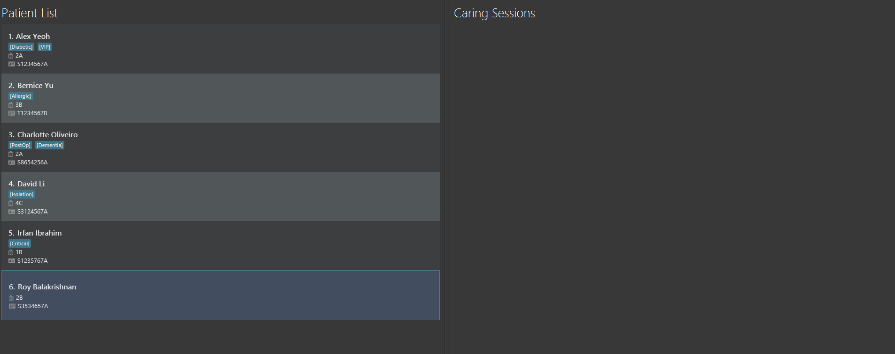

# NOKnock User Guide

**NOKnock** is a **CLI-based nursing home management system** for tracking patients, their Next-of-Kin (NOK) contacts, and caring sessions. It is designed for **nursing home staff who prefer using command-line interfaces** for fast and efficient daily operations.

NOKnock replaces manual tracking and scheduling methods, improving coordination, safety, and productivity in elderly care.

<!--* Table of Contents -->
<page-nav-print />

---

## Quick start

1. Ensure you have Java `17` or above installed in your Computer. 
   **Mac users:** Ensure you have the precise JDK version prescribed [here](https://se-education.org/guides/tutorials/javaInstallationMac.html).

2. Download the latest `.jar` file from [here](https://github.com/AY2526S1-CS2103T-W09-2/tp/releases).

   Copy the file to the folder you wish to use as your NOKnock home folder.
3. Open a command terminal, `cd` into the folder you put the jar file in, and use the `java -jar noknock.jar` command to run the application.

   A GUI similar to the below should appear in a few seconds. Note how the app contains some sample data. 

   

4. Type the command in the command box and press Enter to execute it. e.g. typing **`help`** and pressing Enter will open the help window. 
   Some example commands you can try:
    * `list-patients` — Lists all patients.
    * `add-patient n/Dylan ic/S1234567A w/2A` — Adds a patient named Dylan.
    * `add-nok 1 n/Oad p/+6598765432 r/son` — Adds a NOK for patient #1.
    * `sessions-today` — Shows today’s caring sessions.
    * `exit` — Exits the app.

5. Refer to the [Features](#features) below for details of each command.

---

## Features

<box type="info" seamless>

**Notes about the command format:** 

* Words in `UPPER_CASE` are parameters to be filled by the user. 
  e.g. `add-patient n/NAME ic/IC_NUMBER w/WARD → add-patient n/Dylan ic/S1234567A w/2A`

* Items in square brackets `[ ]` are optional. 
  e.g. `add-patient n/NAME ic/IC_NUMBER [t/TAG]` can be used with or without `t/TAG`.

* Items with `...` can appear multiple times (including zero if the item is optional). 
  e.g. `[t/TAG]...` → no tags, one tag, or many tags.

* Parameters can be in any order. 
  e.g. `n/NAME w/WARD ic/IC_NUMBER` = `ic/IC_NUMBER w/WARD n/NAME`.

* Additional parameters for commands that do not accept them will be ignored. 
  e.g. `help abc` = `help`.

* If you are using a PDF version of this document, be careful when copying and pasting commands that span multiple lines as space characters surrounding line-breaks may be omitted when copied over to the application.

</box>

### Viewing help : `help`

Shows a message explaining how to access the help page.

**Format:**
`help`

---

## Patient Management

### Listing all patients: `list-patients`

Displays all patients with basic information.

**Format:**  
`list-patients`

**Output:**

* Success → Table with Index, Name, IC, Ward, Tags, NOK List, Caring Session List
* None → `No patients in the system`

### Adding a patient: `add-patient`

Creates a new patient record.

**Format:**  
`add-patient n/NAME ic/IC_NUMBER w/WARD [t/TAG]...`

**Examples:**

* `add-patient n/Dylan w/2A ic/S1234567A`
* `add-patient n/Javier w/8B ic/S9876543B t/diabetes t/mobility-issues`

<box type="tip" seamless>

**Note:** Tags are optional and can be used to describe medical or care-related info.

</box>

**Output:**

* Success → `Patient added: Dylan (S1234567A)`
* Duplicate → `Patient with IC S1234567A already exists`
* Invalid input → parameter-specific error message

### Editing a patient: `edit-patient`

Updates an existing patient’s information.

**Format:**  
`edit-patient INDEX [n/NAME] [ic/IC_NUMBER] [w/WARD] [t/TAG]...`

**Examples:**

* `edit-patient 1 n/Yue Yang`
* `edit-patient 2 t/diabetes t/wheelchair`

**Output:**

* Success → `Patient updated: Yue Yang (S1234567A)`
* Invalid index → `Patient index X is out of range`
* Duplicate IC → `IC number already exists for another patient`

### Deleting a patient: `delete-patient`

Removes a patient and all associated data (NOKs, sessions).

**Format:**  
`delete-patient INDEX`

**Example:**  
`delete-patient 1`

**Output:**

* Success → `Patient deleted: Yue Yang (S1234567A)`
* Failure → `Patient not found at index X`

<box type="warning" seamless>

**Caution:** Deleting a patient also deletes all related NOK and caring session data.

</box>

### Viewing patient details: `view-patient`

Shows full patient details including NOKs and upcoming sessions.

**Format:**  
`view-patient INDEX`

**Example:**  
`view-patient 2`

**Output:**

* Success → Full profile with NOK list and upcoming sessions
* Failure → `Patient not found at index X`

### Finding patients by name: `find-patient`

Search for patients by name (case-insensitive, partial matching).

**Format:**  
`find-patient KEYWORD [MORE_KEYWORDS]...`

**Examples:**

* `find-patient dylan`
* `find-patient javier wong`

**Output:**

* Success → `2 patient(s) found:` + list
* None → `No patients found matching: javier wong`

### Finding patients by NOK name: `find-by-nok`

Search for patients based on their NOK’s name.

**Format:**  
`find-by-nok KEYWORD [MORE_KEYWORDS]...`

**Examples:**

* `find-by-nok oad`
* `find-by-nok javier smith`

**Output:**

* Success → `1 patient(s) found (via NOK search):` + list
* None → `No patients found with NOK matching: oad`

---

## Next-of-Kin (NOK) Management

### Adding a NOK: `add-nok`

Adds a Next-of-Kin contact for a patient.

**Format:**  
`add-nok PATIENT_INDEX n/NAME p/PHONE r/RELATIONSHIP`

**Examples:**

* `add-nok 1 n/Oad p/+6598765432 r/son`
* `add-nok 2 n/Dr. Kapikapi p/+656234-5678 r/doctor`

**Output:**

* Success → `NOK added for Dylan: Oad (son, +6598765432)`
* Duplicate → `NOK with same name and phone already exists for this patient`

### Editing a NOK: `edit-nok`

Updates NOK details.

**Format:**  
`edit-nok PATIENT_INDEX NOK_INDEX [n/NAME] [p/PHONE] [r/RELATIONSHIP]`

**Example:**  
`edit-nok 1 1 p/+6588888888`

**Output:**

* Success → `NOK updated for Dylan: Oad (son, +6588888888)`
* Failure → `Patient/NOK not found`

### Deleting a NOK: `delete-nok`

Removes a NOK from a patient.

**Format:**  
`delete-nok PATIENT_INDEX NOK_INDEX`

**Example:**  
`delete-nok 1 2`

**Output:**

* Success → `NOK deleted for Dylan: Oad Smith`
* Failure → `Patient/NOK not found`

---

## Caring Session Management

### Adding a session: `add-session`

Schedules a care session for a patient.

**Format:**  
`add-session PATIENT_INDEX d/DATE time/TIME type/CARE_TYPE [notes/NOTES]`

**Examples:**

* `add-session 1 d/2024-12-25 time/14:30 type/medication notes/Give insulin shot`
* `add-session 2 d/25-12-2024 time/2:30pm type/hygiene`

**Output:**

* Success → `Caring session added for Dylan: medication on 2024-12-25 at 14:30`
* Failure → parameter-specific error (e.g. invalid date/time)

### Editing a session: `edit-session`

Edit an existing care session for a patient. You may also update the session status (`complete` or `incomplete`).

**Format:**
`edit-session PATIENT_INDEX SESSION_INDEX [d/DATE] [time/TIME] [type/CARE_TYPE] [notes/NOTES] [status/STATUS]`

**Examples:**

* `edit-session 1 2 d/2024-12-25 t/14:30 type/medication notes/Adjust dose status/complete`
* `edit-session 2 1 status/incomplete`

**Output:**

* Success -> `Session updated: Dylan - medication - 2024-12-25 14:30 (complete)`
* Failure -> parameter-specific error (e.g. invalid date/time or indices)

### Deleting a session: `delete-session`

Deletes a care session from a patient.

**Format:**  
`delete-session PATIENT_INDEX SESSION_INDEX`

**Example:**
`delete-session 1 2`

**Output:**

* Success → `Caring session deleted for Dylan: medication on 2024-12-25 at 14:30`
* Failure → `Patient/Session not found`

### Viewing today’s sessions: `sessions-today`

Displays all caring sessions scheduled for today.

**Format:**  
`sessions-today`

**Output:**

* Success → `Today's caring sessions (2025-10-22):` + list
* None → `No caring sessions scheduled for today`

### View this week’s sessions: `sessions-week`

Displays all caring sessions scheduled for the current week (Monday to Sunday).

**Format:**  
`sessions-week`

**Output:**

* Success → `This week's caring sessions (2025-10-20 to 2025-10-26):` + list
* None → `No caring sessions scheduled for this week`

---

## Data Management

### Saving the data

NOKnock data are saved in the hard disk automatically after any command that changes the data. There is no need to save manually.

### Editing the data file

NOKnock data are saved automatically as a JSON file `[JAR file location]/data/noknock.json`. Advanced users are welcome to update data directly by editing that data file.

<box type="warning" seamless>

**Caution:** If your changes to the data file makes its format invalid, NOKnock will discard all data and start with an empty data file at the next run. Hence, it is recommended to take a backup of the file before editing it.

Furthermore, certain edits can cause the NOKnock to behave in unexpected ways (e.g., if a value entered is outside the acceptable range). Therefore, edit the data file only if you are confident that you can update it correctly.

</box>

---

## FAQ

**Q**: How do I transfer my data to another Computer? 
**A**: Install the app in the other computer and overwrite the empty data file it creates with the file that contains the data of your previous NOKnock home folder.

---

## Known issues

1. **When using multiple screens**, if you move the application to a secondary screen, and later switch to using only the primary screen, the GUI will open off-screen. The remedy is to delete the `preferences.json` file created by the application before running the application again.
2. **If you minimize the Help Window** and then run the `help` command (or use the `Help` menu, or the keyboard shortcut `F1`) again, the original Help Window will remain minimized, and no new Help Window will appear. The remedy is to manually restore the minimized Help Window.

---

## Command Summary

| **Action**                | **Format / Example**                                                                                                                                                                      |
|---------------------------|-------------------------------------------------------------------------------------------------------------------------------------------------------------------------------------------|
| **List Patients**         | `list-patients`                                                                                                                                                                           |
| **View Patient**          | `view-patient INDEX`                                                                                                                                                                      |
| **Add Patient**           | `add-patient n/NAME ic/IC_NUMBER w/WARD [t/TAG]...` e.g. `add-patient n/Dylan ic/S1234567A w/2A t/diabetes`                                                                            |
| **Edit Patient**          | `edit-patient INDEX [n/NAME] [w/WARD] [ic/IC_NUMBER] [t/TAG]...` e.g. `edit-patient 1 n/Yue Yang`                                                                                      |
| **Delete Patient**        | `delete-patient INDEX` e.g. `delete-patient 2`                                                                                                                                         |
| **Add NOK**               | `add-nok PATIENT_INDEX n/NAME p/PHONE r/RELATIONSHIP` e.g. `add-nok 1 n/Oad p/+6598765432 r/son`                                                                                       |
| **Edit NOK**              | `edit-nok PATIENT_INDEX NOK_INDEX [n/NAME] [p/PHONE] [r/RELATIONSHIP]` e.g. `edit-nok 1 1 p/+6588888888`                                                                               |
| **Delete NOK**            | `delete-nok PATIENT_INDEX NOK_INDEX`                                                                                                                                                      |
| **Add Caring Session**    | `add-caring-session PATIENT_INDEX d/DATE t/TIME type/CARE_TYPE [notes/NOTES]` e.g. `add-caring-session 1 d/2024-12-25 t/14:30 type/medication notes/Give insulin shot`                 |
| **Edit Caring Session**   | `edit-caring-session PATIENT_INDEX SESSION_INDEX [d/DATE] [t/TIME] [type/CARE_TYPE] [notes/NOTES] [status/STATUS]` e.g. `edit-caring-session 1 2 d/2024-12-25 t/14:30 status/complete` |
| **Delete Caring Session** | `delete-caring-session PATIENT_INDEX SESSION_INDEX` e.g. `delete-caring-session 1 2`                                                                                                   |
| **Sessions Today**        | `sessions-today`                                                                                                                                                                          |
| **Sessions Week**         | `sessions-week`                                                                                                                                                                           |
| **Help**                  | `help`                                                                                                                                                                                    |
| **Exit**                  | `exit`                                                                                                                                                                                    |
